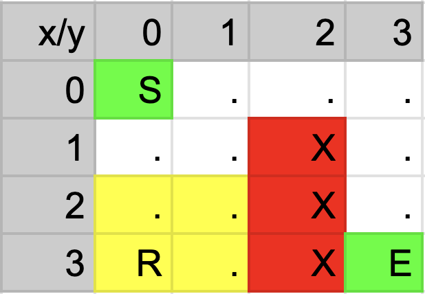
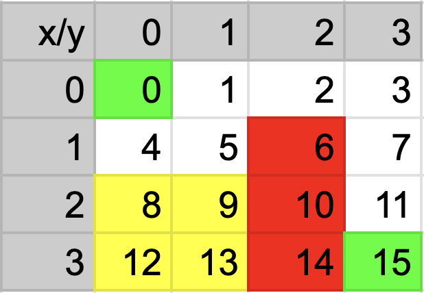

# CSCI 2270 – Data Structures - Assignment 9: Dungeon Crawler

## Objectives

1. Convert a grid representation of a dungeon into an adjacency list.
4. Develop auxiliary functions to determine valid moves and check for contamination in adjacent cells.
2. Implement Depth-First Search (DFS) to navigate through a dungeon maze.
3. Find a valid path from the start cell to the exit cell while avoiding walls and contaminated cells.

## Instructions

Write code to apply the Depth First Traversal. To receive credit for your code, you will need to pass the necessary test cases. Use the following steps to test your code as you work on the assignment:

 1. Open up your Linux terminal, navigate to the build directory of this assignment (e.g. `cd build`).
 2. Run the `cmake ..` command.
 3. Run the `make` command.
 4. If there are no compilation errors, two executables will be generated within the build directory: `run_app` and `run_tests`.
 5. If you would like to run your program including your app implementation in the `main` function, execute `run_app` from the terminal by typing `./run_app`.
 6. To run the grading tests, execute `run_tests` from the terminal by typing `./run_tests`. 

## Overview

In this assignment, you will create a dungeon crawler that navigates a maze represented by a grid. The player must move from the starting point to the exit while avoiding obstacles such as walls and contaminated areas (e.g., radioactive cells).

Each cell in the grid is represented by a specific character:
- **S**: Start cell - This where your player starts
- **E**: Escape cell - This is the escape cell ( there is exactly one escape cell in the maze)
- **.**: Open cell - This is cell to which the player can freely move to.
- **X**: Wall - This is a cell to which the player cannot move to.
- **R**: Radioactive site - These cells are so hazardous, that even their adjacent neighbors are contaminated, which the player must avoid at all costs!

The hero can only see cells directly adjacent to them (in all 8 directions) and can move in these directions. Your task is to use DFS to search for a path from the start (`S`) to the escape (`E`) by converting the grid into an adjacency list representation.

The maze is given to you in the form of a 2-d matrix, and you need to convert it to a graph (i.e with vertices and edges), using the adjacency list representation.

**Note - The maze does not have any invalid configurations, ( such as, a radioactive cell being next to an escape/start. )**

## Class Specifications

The primary class for this assignment is the `Dungeon` class defined in `Dungeon.hpp`. **Do not modify the header file.** Instead, implement the required functionalities in `Dungeon.cpp` as specified below:

### Key Functions

- **void addVertex(int x, int y, cell_type typeOfCell);**  
Add a new vertex in the graph for the given cell at x,y in the grid and set its type (start, escape, open, wall, or radioactive). Use the result from findVertexNumFromPosition() for the vertexNum variable. 

- **int findVertexNumFromPosition(int x, int y);**  
To map each of the (x,y) to a vertex in a graph, you need to assign to each (x,y) a unique vertex number. The following diagram shows how the mapping should look like - 

If suppose the above image represents a 4x4 maze, then the below image would represent the vertices of each cell.

- **bool isContaminated(int x, int y);**  
Determine whether a cell is contaminated. In the image above, there are 4 contaminated cells, (highlighted in yellow)

- **vector<int> findOpenAdjacentPaths(int x, int y);**  
Given a cell’s coordinates, return a vector of vertex numbers of all the adjacent cells (in 8 directions) that are open and not contaminated (This includes the escape cell as well)

- **void convertDungeonToAdjacencyListGraph();**  
Convert the grid into an adjacency list representation by linking each vertex with its valid neighboring vertices.

  
Hint

  Use the functions from above to find the vertex number of a cell, and it's adjacent neighbors.

- **bool isDungeonTraversable();**  
Use DFS (with a helper function) to search for a valid path from the start cell (`S`) to the escape cell (`E`). There could be multiple paths, but you only need to return true if atleast one path exists.
You do not need to add the helper to the .hpp file.

- **Dungeon::~Dungeon();**
Destroy the dungeon object. You need to free all the memory associated with the object. ( both the matrix and the graph ).

Note that for every test run, we make a new maze entirely. So there is no need to reset the visited booleans to false. Additionally, the test cases are populating the 2d array for you. You do not have to handle any file I/O, but it might be useful to look at the input files in the tests directory. 
